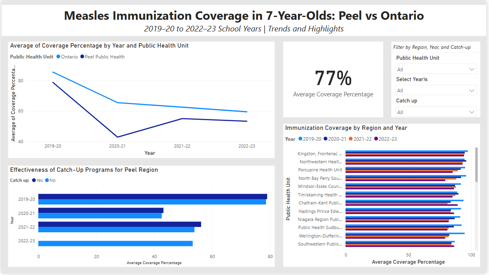

# Measles Immunization Coverage in 7-Year-Olds: Peel vs Ontario (2019–2023)

📊 **Dashboard Type:** Executive-Level Power BI Report  
🧠 **Role:** Data Analyst & Public Health Insights Lead  
🎯 **Use Case:** Regional immunization gap analysis + program impact evaluation  
🗂️ **Tools Used:** Power BI, Excel, DAX, Public Health Ontario datasets

---

## 📋 Executive Summary

This project presents a data-driven analysis of **measles immunization coverage** among **7-year-old schoolchildren** across Ontario, with a particular focus on the **Peel Region**. The interactive dashboard spans the **2019–20 to 2022–23 school years**, a period heavily impacted by the COVID-19 pandemic.

Using representative data from **Public Health Ontario (PHO)**, the dashboard helps public health teams and decision-makers explore:

- Regional trends in childhood measles vaccine uptake  
- Effectiveness of catch-up immunization programs  
- Disparities across public health units  
- Recovery patterns following pandemic disruptions

The visual report was designed to answer **executive-level planning questions** and support **evidence-based program decisions** using best practices in data storytelling, dashboard design, and health analytics.

---

## 🖼️ Dashboard Preview

> 💡 Features interactive slicers for Region, Year, and Catch-Up Programs. See trends, equity gaps, and program effectiveness in one view.

---

## 📊 Executive Questions Answered

1. How did measles vaccine coverage change in Peel vs the Ontario average between 2019 and 2023?
2. What was the impact of catch-up immunization programs in Peel?
3. Which regions showed the largest disparities in vaccine coverage post-pandemic?
4. How can this data inform future regional or provincial public health strategies?

---

## 📍 Data Source & Methodology

- **Source:** [Public Health Ontario – Immunization Coverage Report (2019–2023)](https://www.publichealthontario.ca/en/data-and-analysis/immunization/coverage)
- **Scope:** Measles vaccine coverage among **7-year-old students**, typically assessed at school entry
- **Data Transformation:** Structured in Excel, modeled and visualized in Power BI
- **User Controls:** Filters by Region, Year, and Catch-Up status for user-driven insights

---

## 📈 Dashboard Features

| Visual | Purpose |
|--------|---------|
| **Line Chart** | Track year-over-year trends (Peel vs Ontario) |
| **Catch-Up Program Chart** | Evaluate recovery programs’ effectiveness |
| **Stacked Bar by Region & Year** | Identify equity gaps in vaccine coverage |
| **KPI Card** | Show average coverage dynamically by filters |
| **Dropdown Slicers** | Support multi-dimensional filtering |

---

## 🧠 Key Insights

### 📉 1. Pandemic Disruption & Decline
- Peel dropped from **78.6% to 42.9%** coverage between 2019–20 and 2020–21.
- Ontario overall dropped from **84.5% to 54.1%**.
- **Insight:** Pandemic disrupted routine immunization province-wide. Peel was among the hardest hit.

### 🩹 2. Catch-Up Program Effectiveness
- Catch-up recipients in Peel had **up to 10% higher coverage** than those who did not.
- **Insight:** Targeted recovery programs showed measurable success, but not full restoration.

### 🌍 3. Persistent Regional Inequities
- In 2022–23, some PHUs exceeded **90%**, while others remained **below 50%**.
- **Insight:** Resource gaps between urban and rural PHUs must be addressed.

### 📌 4. Peel Still Lagging
- Peel reached **61.4%** by 2022–23 — still 17 points below the Ontario average.
- **Recommendation:** Allocate targeted outreach and follow-up strategies in high-population, low-coverage areas.

---

## 💼 Strategic Recommendations

1. **Target Underserved PHUs** using resource-aware outreach
2. **Scale Catch-Up Initiatives** based on measurable ROI
3. **Deploy Real-Time Dashboards** at local and provincial levels
4. **Define Equity Benchmarks** post-pandemic for long-term tracking

---

## 📚 Skills Demonstrated

- Public health analytics with real government datasets
- Power BI dashboard design with advanced layout and interactivity
- Data storytelling for executive audiences
- DAX for custom KPI calculation
- Health equity & program effectiveness evaluation

---

## 📂 Repository Contents

| File | Description |
|------|-------------|
| `Peel_Project.pbix` | Interactive Power BI file |
| `dashboard.png` | Clean screenshot for preview |
| `Peel_vs_Ontario_Dashboard.pdf` | Printable dashboard export |
| `README.md` | Full project write-up and executive insights |

---
